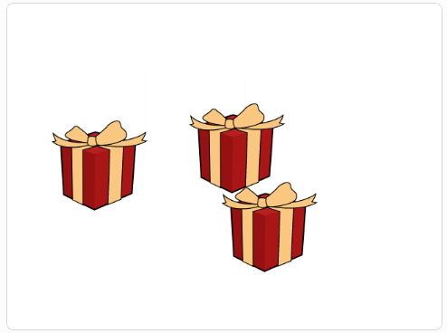

## Introduction

In this project, you will make a game that will help you to improve your concentration. You will have to watch really carefully to try to follow the gift box with the diamond inside, while the other boxes and sprites try to distract you. Playing computer games can be a good way to relax and learn new skills — just make sure that you balance gaming with other activities. 

### What you will make

--- no-print ---
Watch the box with the diamond inside as it moves around. When the boxes stop moving, click on the one that you think has the diamond inside it and see if you got it right.

<iframe src="https://scratch.mit.edu/projects/405012395/embed" allowtransparency="true" width="485" height="402" frameborder="0" scrolling="no" allowfullscreen></iframe>

--- /no-print ---

--- print-only ---

--- /print-only ---

--- collapse ---
---
title: What you will need
---
### Hardware

+ A computer or tablet capable of running Scratch

### Software

+ Scratch 3 (either [online](http://rpf.io/scratchon){:target="_blank"} or [offline](http://rpf.io/scratchoff){:target="_blank"}.)

--- /collapse ---

--- collapse ---
---
title: What you will learn
---

- How to use `broadcasts`{:class="block3events"} to communicate between sprites
- How to detect when two sprites `touch`{:class="block3sensing"} each other
- How to use `and`{:class="block3operators"} and `not`{:class="block3operators"} Boolean operators

--- /collapse ---

--- collapse ---
---
title: Additional information for educators
---

You can [download the completed project here](http://rpf.io/p/en/focus-on-the-prize-get){:target="_blank"}.

If you need to print this project, please use the [printer-friendly version](https://projects.raspberrypi.org/en/projects/focus-on-the-prize/print){:target="_blank"}.

--- /collapse ---
