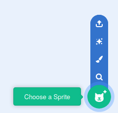
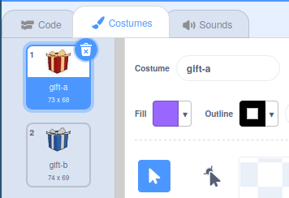
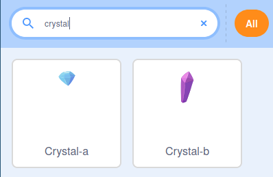

## Gift in a box

In this step, you will add a gift box, that will briefly show what is hidden inside it.

--- task ---

Open a new Scratch project.

**Online:** open a new online Scratch project at [rpf.io/scratch-new](http://rpf.io/scratch-new){:target=”_blank”}.

**Offline:** open a new project in the offline editor.If you need to download and install the Scratch offline editor, you can find it at [rpf.io/scratchoff](http://rpf.io/scratchoff){:target=”_blank”}.

--- /task ---

--- task ---

Delete the Scratch cat sprite, by clicking on the trashcan icon in the corner.


--- /task ---

--- task ---

Go to **Choose a Sprite** to search for a new sprite to add to your game.



--- /task ---

--- task ---

Search for the **Gift** sprite, and then add it to your game.


--- /task ---

--- task ---

The sprite is a little small at the moment. Previously you may have increased a sprite's size using the `set size to`{:class="block3looks"} block, but you can also increase the size of the sprite by changing it's *properties*.

Set the sprite's size to **150%**


--- /task ---

--- task ---

Use the **Costumes** tab to look at the costumes for the **Gift** sprite. You will see two costumes called **gift-a** and **gift-b**.



Go to the **Choose a Costume** icon to add a new costume to the sprite.


--- /task ---

--- task ---

Choose the gift that you would like to be inside the gift box. In this example, the **Crystal-a** costume will be used.



--- /task ---

--- task ---

Switch back to the code tab so you can begin to work on the program.


Add some blocks to make the starting costume for the sprite **Gift** to switch to **Crystal-a** and then back to **gift-a**, again with `wait`{:class="block3control"} blocks in between.

The `wait`{:class="block3control"} blocks give the player a chance to see the costume changes.


```blocks3
when flag clicked
switch costume to [gift-a v]
wait (1) seconds
switch costume to [Crystal-a v]
wait (2) seconds
switch costume to [gift-a v]
``` 

--- /task ---

--- task ---

Click the green flag, to make sure that your gift box changes costumes.

--- /task ---

--- save ---
