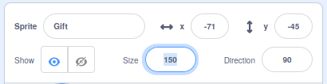
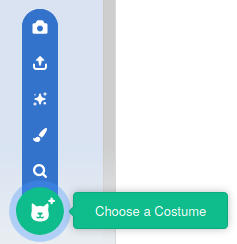

## Gift in a box

In this step, you will add a gift box, that will briefly show what is hidden inside it.

--- task ---

Delete the Scratch cat sprite, by clicking on the trashcan icon in the corner.


--- /task ---

--- task ---

Use the **Choose a Sprite** icon, to search for a new sprite to add to your game.


--- /task ---

--- task ---

Search for the **Gift** sprite, and then add it to your game.


--- /task ---

--- task ---

The sprite is a little small at the moment, so increase the size of the sprite to **150%**



--- /task ---

--- task ---

Use the **Costumes** tab to look at the costumes for the **Gift** sprite.


Then use the **Choose a Costume** icon to add a new costume to the sprite.



--- /task ---

--- task ---

Choose the gift that you would like to be inside the gift box. In this example, the **Crystal-a** costume will be used.\


--- /task ---

--- task ---

Back on the code tab, add some blocks to make the starting costume for the sprite **gift-a** then switch to **Crystal-a** and then back to **gift-a**, with wait blocks inbetween.

```blocks3
when flag clicked
switch costume to [gift-a v]
wait (1) seconds
switch costume to [Crystal-a v]
wait (2) seconds
switch costume to [gift-a v]
```

--- /task ---

--- task ---

Click the green flag, to make sure that your gift box changes costumes.

--- /task ---

--- save ---
