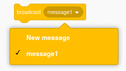

## Move it

Now that you have a box with a gift inside it, it's time to make it move around the screen.

--- task ---

To start with, give the gift a starting position to the left of the screen.


```blocks3
when flag clicked
+ go to x: (150) y: (0)
switch costume to [gift-a v]
wait (1) seconds
switch costume to [Crystal-a v]
wait (2) seconds
switch costume to [gift-a v]
``` 

--- /task ---

Broadcasts are messages that are sent by a sprite to some or all other sprites to receive.

Broadcasts are very useful for making sure that events in your program all happen at the same time.

In `events`{:class="block3events"}, seelct the `broadcast`{:class="block3events"} block.

--- task ---

Create a new `broadcast`{:class="block3events"} to start moving. Call your new broadcast `move`{:class="block3events"}




--- /task ---

--- task ---

After a `wait`{:class="block3control"} of `1` `second`{:class="block3control"} the `move`{:class="block3events"} block can be used.


```blocks3
when flag clicked
go to x: (150) y: (0)
switch costume to [gift-a v]
wait (1) seconds
switch costume to [Crystal-a v]
wait (2) seconds
switch costume to [gift-a v]
+ wait (1) seconds
+ broadcast [move v] and wait
``` 

--- /task ---

--- task ---

When the `move`{:class="block3events"} broadcast is received, the sprite can start moving in random directions. You can use a `repeat`{:class="block3control"} block to make this happen `10` times.


```blocks3
when I receive [move v]
repeat (10)
glide (1) secs to [random position v]
```

--- /task ---

--- task ---

Click the green flag to check that your sprite starts randomly moving, after the costume changes.

--- no-print ---


--- /no-print ---

--- /task ---

--- save ---


