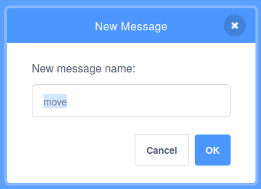

## Move the gift box

Now that you have a box with a gift inside it, you need to make it move around the screen.

--- task ---

First, use a `go to x: y:`{:class="block3motion"} block to give the gift a starting position to the left of the Stage.


```blocks3
when flag clicked
+ go to x: (150) y: (0)
switch costume to [gift-a v]
wait (1) seconds
switch costume to [Crystal-a v]
wait (2) seconds
switch costume to [gift-a v]
``` 

--- /task ---

**Broadcasts** are messages that are sent by a sprite for some or all other sprites to receive.

Broadcasts are very useful for making sure that events in your program all happen simultaneously.

In the `Events`{:class="block3events"} blocks menu, select the `broadcast message1 and wait`{:class="block3events"} block.

--- task ---

Create a new `broadcast`{:class="block3events"} to start moving. Call your new broadcast `move`.




--- /task ---

--- task ---

Add a `wait`{:class="block3control"} block, then add the `broadcast move and wait`{:class="block3events"} block.


```blocks3
when flag clicked
go to x: (150) y: (0)
switch costume to [gift-a v]
wait (1) seconds
switch costume to [Crystal-a v]
wait (2) seconds
switch costume to [gift-a v]
+ wait (1) seconds
+ broadcast [move v] and wait
``` 

--- /task ---

--- task ---

When the sprite `receives`{:class="block3events"} the `move`{:class="block3events"} broadcast, the sprite can start to `glide`{:class="block3motion"} in random directions. You can use a `repeat`{:class="block3control"} block to make this happen `10` times.


```blocks3
when I receive [move v]
repeat (10)
glide (1) secs to [random position v]
```

--- /task ---

--- task ---

Click on the green flag, and check that your sprite starts moving randomly, after the costume changes.

--- no-print ---


--- /no-print ---

--- /task ---

--- save ---

*[simultaneously]: This means 'at the same time'.


