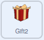
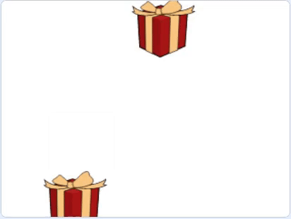

## Add an empty box

In this step, you will add another gift box, but this one will be empty! It will also move around in random directions.

--- task ---

Add a second **Gift** sprite. This one will be named **Gift2** automatically.


Remember to increase its size to `150` (percent).

--- /task ---

--- task ---

Set the **Gift2** sprite to start in the centre of the Stage.



```blocks3
when green flag clicked
go to x: (0) y: (0)
```

--- /task ---

--- task ---

Add blocks so that when this sprite `receives move`{:class="block3events"}, it also starts to `glide`{:class="block3motion"} in random directions.


```blocks3
when I receive [move v]
repeat (10)
glide (1) secs to [random position v]
```

--- /task ---

--- task ---

Click on the green flag, and watch the two sprites move around the Stage.

--- no-print ---



--- /no-print ---

--- /task ---

The boxes should always move at the same speed as each other. At the moment, they are set to `glide 1 secs`{:class="block3motion"}. To change the speed of both boxes easily, you can use a `variable`{:class="block3variables"}.

--- task ---

Create a new `variable`{:class="block3variables"} called `speed`, and add it to the `glide 1 secs to random position`{:class="block3motion"} block. Add this block to both the **Gift** and **Gift2** sprites.


```blocks3
when I receive [move v]
repeat (10)
+ glide (speed) secs to [random position v]
```

--- /task ---

--- task ---

In the code for the **Gift** sprite, you can add code to `set`{:class="block3variables"} the `speed`{:class="block3variables"} variable. Choose any value you like.


```blocks3
when flag clicked
+ set [speed v] to (1)
go to x: (-150) y: (0)
switch costume to [gift-a v]
wait (1) seconds
switch costume to [Crystal-a v]
wait (2) seconds
switch costume to [gift-a v]
wait (1) seconds
broadcast [move v] and wait
``` 

--- /task ---

--- task ---

Experiment with different values, until you find a speed you like.

--- /task ---

--- save ---


