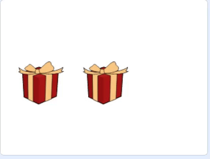

## Add the answers

In this step, you will add code so that the player can click on a gift box to see if it has the crystal inside it.

--- task ---

In the code for the **Gift** sprite, add code so that `when this sprite clicked`{:class="block3events"}, it `says`{:class="block3looks"} `Yes!` and `switches costume to`{:class="block3looks"} the crystal.


```blocks3
when this sprite clicked
say [Yes!]
switch costume to [Crystal-a v]
```

--- /task ---

--- task ---

Click on the **Gift2** sprite and add blocks so that it `says`{:class="block3looks"} `No!`. Change the value of the `says`{:class="block3looks"} block to `1` second. Add a `hide`{:class="block3looks"} block so the sprite then disappears.


```blocks3
when this sprite clicked
say [No!] for (1) seconds
hide
```

--- /task ---

--- task ---

As the **Gift2** sprite can now be hidden, you need to add a `show`{:class="block3looks"} block to make sure that it is visible when the program starts.


```blocks3
when green flag clicked
go to x: (0) y: (0)
+ show
```

--- /task ---

--- task ---

Click on the green flag to run your code, and test what happens when you click on the boxes.

--- /task ---

You may notice that you can click on the boxes while they are moving around. You can use a `variable`{:class="block3variables"} to stop players cheating like this.

--- no-print ---

_

--- /no-print ---

--- task ---

Create a new `variable`{:class="block3variables"} called `finished`. Add blocks to `set`{:class="block3variables"} the `finished`{:class="block3variables"} variable to `false` when the gifts start moving, and then to `true` when the gifts stop moving.


```blocks3
when flag clicked
set [speed v] to (1)
+ set [finished v] to [false]
go to x: (-150) y: (0)
switch costume to [gift-a v]
wait (1) seconds
switch costume to [Crystal-a v]
wait (2) seconds
switch costume to [gift-a v]
wait (1) seconds
broadcast [move v] and wait
+ set [finished v] to [true]
``` 

--- /task ---

--- task ---

Now, you can use an `if … then`{:class="block3control"} block to check if `finished`{:class="block3variables"} is true or false. Add an `Operators`{:class="block3operators"} block so that the clicking only has any effect if `finished`{:class="block3variables"} `=`{:class="block3operators"} `true`.


```blocks3
when this sprite clicked
+ if <(finished) = [true]> then
say [Yes!]
switch costume to [Crystal-a]
```

--- /task ---

--- task ---

Add the same `if`{:class="block3control"} condition to the **Gift2** sprite.


```blocks3
when this sprite clicked
+ if <(finished) = [true]> then
say [No!] for (1) seconds
hide
```

--- /task ---

--- task ---

Test your program, and you should see that you can only click on the sprites when they have finished moving around.

--- /task ---

--- save ---
	


