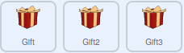

## More gifts

In this step you will make sure the gifts are not touching each other, or the edge of the screen when they stop moving, and then add a third gift.

--- task ---

It is possible that the gift boxes will finish their motion on top of each other, which might make it difficult to see which is which. To stop this from happening, you can detect if they are touching.

--- /task ---

--- task ---

Add a third Gift sprite to your game, and set it's size to 150%

--- /task ---

T
