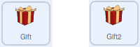
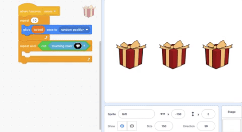
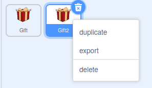

## Add more gifts

In this step, you will make sure that the gifts are not touching each other, or the edge of the screen, when they stop moving. Then, you will add a third gift.

It is possible that the gift boxes will stop on top of each other, which might make it difficult to see which gift box is which. To stop this from happening, you can detect if they are touching. The colour of the gift box's ribbon can be used to detect if two boxes are touching each other. 

You need to add the scripts shown below to **both** the **Gift** and **Gift2** sprites.

--- task ---

You can use the `not`{:class="block3operators"} operator to turn **true** into **false**, or **false** into **true**.

Add a `repeat until`{:class="block3control"} block to the bottom of your script, and place a `not`{:class="block3operators"} block inside it.




```blocks3
when I receive [move v]
repeat (10)
    glide (speed) secs to [random position v]
end
+ repeat until <not <>>
```

--- /task ---

--- task ---

A `Sensing`{:class="block3sensing"} block that detects if a sprite is touching a particular colour would return **true** when the sprite touches that colour.

You can use the `not`{:class="block3operators"} operator to detect if a sprite is `not`{:class="block3operators"} `touching`{:class="block3sensing"} a particular colour.

Add in a `touching color`{:class="block3sensing"} block, and use the **Colour picker** tool to select the colour of the ribbon.

--- no-print ---



--- /no-print ---


```blocks3
when I receive [move v]
repeat (10)
glide (speed) secs to [random position v]
end
+ repeat until <not <touching color (#F9C780)>>
```

--- /task ---

--- task ---

Within the `repeat until`{:class="block3control"} block, add another block to keep the box moving to a random position.


```blocks3
when I receive [move v]
repeat (10)
glide (speed) secs to [random position v]
end
repeat until <not <touching color (#F9C780) ?>>
+ glide (speed) secs to [random position v]
```

--- /task ---

--- task ---

Click on the green flag a few times, and make sure that the boxes always move to an empty area of the Stage before they stop moving.

--- /task ---

It would also be nice if the boxes did not stop when they are off the edge of the Stage. You can use an `and`{:class="block3operators"} operator to test for two different conditions.

--- task ---

Add an `and`{:class="block3operators"} block into the `repeat until`{:class="block3control"} condition. Then, add in a `not`{:class="block3operators"} block and a `touching edge`{:class="block3sensing"} block to go with the `not`{:class="block3operators"} `touching color`{:class="block3sensing"} blocks.


```blocks3
when I receive [move v]
repeat (10)
glide (speed) secs to [random position v]
end
repeat until < <not <touching color (#F9C780) ?>> and <not <touching [edge v] ?>>
glide (speed) secs to [random position v]
```

--- /task ---

--- task ---

Test your code again, to make sure that the boxes now do not stop at the edge of the Stage.

--- /task ---

Now that the code for the **Gift** and **Gift2** sprites is complete, you can duplicate the **Gift2** sprite to add a third box to the game.

--- task ---

Right-click on the **Gift2** sprite in the Sprite list and select **duplicate** in the drop-down menu.



--- /task ---

--- task ---

All the code has been duplicated as well, but you need to give the **Gift3** sprite a different starting position.


```blocks3
when flag clicked
+ go to x: (150) y: (0)
show
```
--- /task ---

--- task ---

To test your game again, click on the green flag.

--- /task ---

--- save ---
