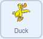

## Add a distraction

To finish the game, you can add a distraction, to try to stop the player keeping their eyes on the gift box.

--- task ---

Add a new sprite to your game. You can choose any sprite you like, but in this example, we will use the **Duck** sprite.



--- /task ---

When the game begins, the duck should be hidden, and it should only start to move after the boxes have started moving. It is also useful to bring the duck to the front layer, so that it moves over the top of the boxes.

--- task ---

Add the following blocks to the **Duck** sprite.


```blocks3
when flag clicked
hide
go to [front v] layer
wait (4) seconds
```

--- /task ---

--- task ---

Next, the **Duck** sprite should `wait`{:class="block3control"}  a `random`{:class="block3operators"} number of seconds, then `glide`{:class="block3motion"} across the Stage and `hide`{:class="block3looks"}. This can keep happening until the game has finished.


```blocks3
when flag clicked
hide
go to [front v] layer
wait (4) seconds
+ repeat until <(finished) = [true]>
wait (pick random (1) to (5)) seconds
go to x: (-280) y: (-140)
show
glide (2) secs to x: (280) y: (140)
hide
```
--- /task ---

--- task ---

Test your game and see if you can keep track of the gift box with a distracting duck flying across the Stage.

--- /task ---

--- save ---

