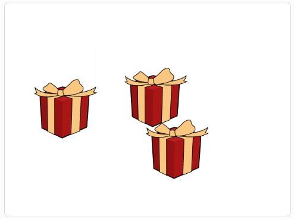

## परिचय

इस प्रोजेक्ट में, आप एक ऐसा गेम बनाएंगे जो आपकी एकाग्रता में सुधार करने में आपकी मदद करेगा। हीरे के साथ वाले गिफ्ट बॉक्स पर नज़र रखने का प्रयास करने के लिए आपको वास्तव में ध्यान से देखना होगा, क्यूंकी अन्य बक्से और स्प्राइट आपको विचलित करने का प्रयास करेंगे। कंप्यूटर पर गेम खेलना आराम करने और नए कौशल सीखने का एक अच्छा तरीका हो सकता है - बस सुनिश्चित करें कि आप अन्य गतिविधियों के साथ गेमिंग को संतुलित करते हैं।

### आप क्या बनाएँगे

--- no-print ---

हीरे के साथ बॉक्स को देखें जैसे जैसे यह चारों ओर घूमता है। जब बक्से हिलना बंद कर दें, तो उस पर क्लिक करें जसिमें आपको लगता है कि इसके अंदर हीरा है और देखें कि क्या आपने इसे सही किया है।

<iframe src="https://scratch.mit.edu/projects/405012395/embed" allowtransparency="true" width="485" height="402" frameborder="0" scrolling="no" allowfullscreen></iframe>

--- /no-print ---

--- print-only ---

--- /print-only ---

--- collapse ---
---
title: आपको किन चीजों की आवश्यकता होगी
---

### हार्डवेयर

+ Scratch चलाने में सक्षम कंप्यूटर या टैबलेट

### सॉफ्टवेयर

+ Scratch 3 (या तो [ऑनलाइन](https://rpf.io/scratchon){:target="_blank"} या [ऑफलाइन](https://rpf.io/scratchoff){:target="_blank"}.)

--- /collapse ---

--- collapse ---
---
title: आप क्या सीखेंगे
---

- `broadcasts`{:class="block3events"} का उपयोग स्प्राइट्स के बीच बातचीत कराने के लिए कैसे करें
- कैसे पता लगाया जाए जब दो स्प्राइट एक दूसरे को (छूते हैं) `touch`{:class="block3sensing"}
- `and`{:class="block3operators"} और `not`{:class="block3operators"} बूलियन ऑपरेटर्स का उपयोग कैसे करें

--- /collapse ---

--- collapse ---
---
title: शिक्षकों के लिए अतिरिक्त जानकारी
---

आप [पूरे प्रॉजेक्ट को यहाँ डाउनलोड कर सकते हैं ](https://rpf.io/p/en/focus-on-the-prize-get){:target="_blank"}.

अगर आपको इस प्रोजेक्ट को प्रिंट करने की आवश्यकता है, तो कृप्या [प्रिंटर-अनुकूल संस्करण](https://projects.raspberrypi.org/en/projects/focus-on-the-prize/print){:target="_blank"} का उपयोग करें।

--- /collapse ---
