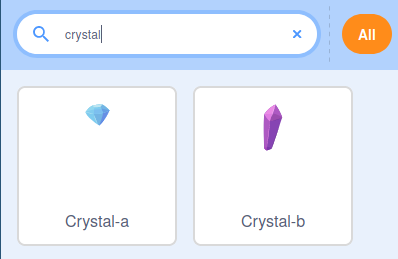

## बॉक्स में गिफ्ट (उपहार) जोड़ें

इस चरण में, आप एक गिफ्ट बॉक्स जोड़ेंगे जो कुछ समय के लिए दिखाएगा कि इसके अंदर क्या छिपा है।

--- task ---

एक नया Scratch प्रोजेक्ट खोलें।

**ऑनलाइन:** [rpf.io/scratch-new](http://rpf.io/scratch-new){:target="_blank"} पर एक नया ऑनलाइन Scratch प्रोजेक्ट खोलें।

**ऑफ़लाइन:** ऑफ़लाइन एडिटर में एक नया स्क्रॅच प्रोजेक्ट खोलें। यदि आपको ज़रूरत है तो, आप [यहां Scratch डाउनलोड और इंस्टॉल ](http://rpf.io/scratchoff){:target="_blank"} कर सकते हैं

--- /task ---

--- task ---

**Scratch cat** स्प्राइट हटाएं। ऐसा करने के लिए, स्प्राइट सूची में छवि के कोने में **Rubbish bin** पर क्लिक करें


--- /task ---

--- task ---

अपने खेल में जोड़ने के लिए एक नया स्प्राइट खोजने के लिए **Choose a Sprite** पर क्लिक करें।


--- /task ---

--- task ---

**Gift** स्प्राइट खोजें, फिर उसे अपने खेल में जोड़ें।


--- /task ---

--- task ---

स्प्राइट इस समय थोड़ा छोटा है। स्प्राइट के आकार को बढ़ाने के लिए, आप या तो `set size to`{:class="block3looks"} ब्लॉक में उपयोग कर सकते हैं, जैसा कि आपने अन्य प्रोजेक्ट्स में किया होगा, या आप स्प्राइट के **properties** को बदल सकते हैं।

स्प्राइट का आकार `150` (प्रतिशत) पर सेट करें।


--- /task ---

--- task ---

**Gift** स्प्राइट के लिए पोशाकें देखने के लिए **Costumes** पर क्लिक करें आपको दो पोशाकें दिखाई देंगी जिन्हें **gift-a** और **gift-b** कहा जाएगा।


स्प्राइट के लिए एक नया पोशाक जोड़ने के लिए **Choose a Costume** आइकन पर क्लिक करें।


--- /task ---

--- task ---

वह उपहार चुनें जिसे आप गिफ्ट बॉक्स के अंदर रखना चाहते हैं। इस उदाहरण में, हम **Crystal-a** पोशाक का उपयोग करेंगे।



--- /task ---

--- task ---

**Code** टैब पर वापस जाएं ताकि आप प्रोग्राम पर काम करना शुरू कर सकें।


**Gift** स्प्राइट के लिए शुरुआती पोशाक बनाने के लिए कुछ ब्लॉक जोड़ें `Crystal-a`{:class="block3looks"} ब्लॉक को `switch`{:class="block3looks"} करें और फिर से `gift-a`{:class="block3looks"} ब्लॉक पर। पोशाक परिवर्तन के बीच में `wait`{:class="block3control"} ब्लॉक का उपयोग करें।

`wait`{:class="block3control"} ब्लॉक खिलाड़ी को पोशाक परिवर्तन देखने का मौका देते हैं।


```blocks3
when flag clicked
switch costume to [gift-a v]
wait (1) seconds
switch costume to [Crystal-a v]
wait (2) seconds
switch costume to [gift-a v]
```

--- /task ---

--- task ---

हरे झंडे पर क्लिक करें, और सुनिश्चित करें कि आपका गिफ्ट बॉक्स वेशभूषा बदलता है।

--- /task ---

--- save ---
