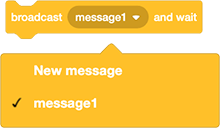

## गिफ्ट बॉक्स को हिलाएँ

अब जब आपके पास उपहार के साथ एक बॉक्स है, तो आपको इसे स्क्रीन के चारों ओर घुमाने की जरूरत है।

--- task ---

सबसे पहले, उपहार को स्टेज के बाईं ओर एक प्रारंभिक स्थिति देने के लिए `go to x: y:`{:class="block3motion"} ब्लॉक का उपयोग करें


```blocks3
when flag clicked
+ go to x: (-150) y: (0)
switch costume to [gift-a v]
wait (1) seconds
switch costume to [Crystal-a v]
wait (2) seconds
switch costume to [gift-a v]
```

--- /task ---

**Broadcasts** वे संदेश हैं जो स्प्राइट द्वारा भेजे जाते हैं जो कुछ या सभी अन्य स्प्राइट प्राप्त कर सकें।

प्रसारण यह सुनिश्चित करने के लिए बहुत उपयोगी हैं कि आपके कार्यक्रम में सभी घटनाएँ एक ही समय पर हों

`Events`{:class="block3events"} ब्लॉक मेनू में, `broadcast message1 and wait`{:class="block3events"} ब्लॉक का चयन करें।

--- task ---

चलना शुरू करने के लिए एक नया `broadcast`{:class="block3events"} बनाएं। अपने नए ब्रॉडकास्ट (प्रसारण) को `move` नाम दें




--- /task ---

--- task ---

एक `wait`{:class="block3control"} ब्लॉक जोड़ें, फिर `broadcast move and wait`{:class="block3events"} ब्लॉक जोड़ें।


```blocks3
when flag clicked
go to x: (-150) y: (0)
switch costume to [gift-a v]
wait (1) seconds
switch costume to [Crystal-a v]
wait (2) seconds
switch costume to [gift-a v]
+ wait (1) seconds
+ broadcast [move v] and wait
```

--- /task ---

--- task ---

जब स्प्राइट को `move`{:class="block3events"} प्रसारण प्राप्त होता है`receives`{:class="block3events"}, तो स्प्राइट `glide`{:class="block3motion"} करना शुरू कर सकता है। आप `10` बार `repeat`{:class="block3control"} ब्लॉक का उपयोग कर सकते हैं।


```blocks3
when I receive [move v]
repeat (10)
glide (1) secs to [random position v]
```

--- /task ---

--- task ---

हरे झंडे पर क्लिक करें, और जांचें कि पोशाक बदलने के बाद, आपका स्प्राइट बेतरतीब ढंग से हिलना शुरू कर देता है।

--- no-print ---


--- /no-print ---

--- /task ---

--- save ---


