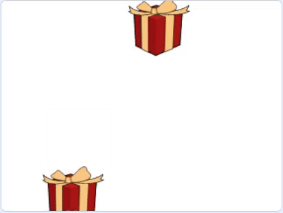

## एक खाली बॉक्स बनाएं

इस चरण में, आप एक और उपहार बॉक्स जोड़ेंगे, लेकिन यह खाली रहेगा! यह भी यादृच्छिक दिशाओं में घूमेगा।

--- task ---

दूसरा **gift** स्प्राइट जोड़ें। इसे स्वचालित रूप से **Gift2** नाम दिया जाएगा।


इसका आकार बढ़ाकर `150` (प्रतिशत) करना याद रखें।

--- /task ---

--- task ---

**Gift2** स्प्राइट को इस तरह सेट करें की यह Stage के केंद्र में शुरू हो।


```blocks3
when green flag clicked
go to x: (0) y: (0)
```

--- /task ---

--- task ---

ब्लॉक जोड़ें ताकि जब यह स्प्राइट `receives move`{:class="block3events"} प्राप्त करे, तो यह यादृच्छिक दिशाओं में `glide`{:class="block3motion"} यादृच्छिक दिशाओं में करना शुरू कर दे।


```blocks3
when I receive [move v]
repeat (10)
glide (1) secs to [random position v]
```

--- /task ---

--- task ---

हरे झंडे पर क्लिक करें, और दोनो स्प्राइट्स को Stage के चारों ओर घूमते हुए देखें।

--- no-print ---



--- /no-print ---

--- /task ---

बक्सों को हमेशा एक दूसरे के समान गति से चलना चाहिए। फिलहाल, वे `glide 1 secs`{:class="block3motion"} पर सेट हैं। दोनों बक्सों की गति को आसानी से बदलने के लिए, आप `variable`{:class="block3variables"} का उपयोग कर सकते हैं।

--- task ---

एक नया `variable`{:class="block3variables"} बनाएं जिसे `speed`कहा जाता है, और इसे `glide 1 secs to random position`{:class="block3motion"} ब्लॉक में जोड़ें। इस ब्लॉक को **Gift** और **Gift2** स्प्राइट दोनों में जोड़ें।


```blocks3
when I receive [move v]
repeat (10)
+ glide (speed) secs to [random position v]
```

--- /task ---

--- task ---

**Gift** स्प्राइट के कोड में, आप `set`{:class="block3variables"} `speed`{:class="block3variables"} वेरिएबल में कोड जोड़ सकते हैं। अपनी पसंद का कोई भी मान चुनें।


```blocks3
when flag clicked
+ set [speed v] to (1)
go to x: (-150) y: (0)
switch costume to [gift-a v]
wait (1) seconds
switch costume to [Crystal-a v]
wait (2) seconds
switch costume to [gift-a v]
wait (1) seconds
broadcast [move v] and wait
```

--- /task ---

--- task ---

विभिन्न मानों के साथ प्रयोग करें, जब तक कि आपको अपनी पसंद की गति न मिल जाए।

--- /task ---

--- save ---


