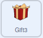

## और उपहार जोड़ें

इस चरण में, आप यह सुनिश्चित करेंगे कि उपहार एक दूसरे को, या स्क्रीन के किनारे को स्पर्श नहीं कर रहे हैं, जब वे हिलना बंद कर देते हैं। फिर, आप तीसरा उपहार जोड़ेंगे।

हो सकता है कि गिफ्ट बॉक्स एक-दूसरे के ऊपर आके रुक जाएं, जिससे यह देखना मुश्किल हो जाएगा कि कौन सा गिफ्ट बॉक्स कौन सा है। ऐसा होने से रोकने के लिए, आप पता लगा सकते हैं कि वे छू रहे हैं या नहीं। गिफ्ट बॉक्स के रिबन के रंग का उपयोग यह पता लगाने के लिए किया जा सकता है कि क्या दो बॉक्स एक दूसरे को छू रहे हैं।

आपको नीचे दिखाई गई स्क्रिप्ट को **दोनों** **Gift** और **Gift2** स्प्राइट में जोड़ना होगा।

--- task ---

**true** को **false**, या **false** को **true** में बदलने के लिए `not`{:class="block3operators"} ऑपरेटर का उपयोग कर सकते हैं।

एक `repeat until`{:class="block3control"} ब्लॉक अपनी स्क्रिप्ट के नीचे जोड़ें और उसके नीच एक `not`{:class="block3operators"} ब्लॉक रखें।


```blocks3
when I receive [move v]
repeat (10)
    glide (speed) secs to [random position v]
end
+ repeat until <not <>>
```

--- /task ---

--- task ---

एक `Sensing`{:class="block3sensing"} ब्लॉक जो यह पता लगाता है कि स्प्राइट किसी विशेष रंग को छू रहा है या नहीं, **true** दर्शाएगा जब स्प्राइट उस रंग को छूता है

आप `not`{:class="block3operators"} ऑपरेटर का उपयोग यह पता लगाने के लिए कर सकते हैं कि कोई स्प्राइट एक विशेष रंग को `not`{:class="block3operators"} `touching`{:class="block3sensing"} है या नहीं।

`touching color`{:class="block3sensing"} ब्लॉक को जोड़ें, और रिबन के रंग का चयन करने के लिए **Colour picker** टूल का उपयोग करें

--- no-print ---


--- /no-print ---


```blocks3
when I receive [move v]
repeat (10)
glide (speed) secs to [random position v]
end
+ repeat until <not <touching color (#F9C780)>>
```

--- /task ---

--- task ---

`repeat until`{:class="block3control"} के भीतर, बॉक्स को यादृच्छिक स्थिति में ले जाने के लिए एक और ब्लॉक जोड़ें।


```blocks3
when I receive [move v]
repeat (10)
glide (speed) secs to [random position v]
end
repeat until <not <touching color (#F9C780) ?>>
+ glide (speed) secs to [random position v]
```

--- /task ---

--- task ---

हरी झंडी पर कुछ बार क्लिक करें, और सुनिश्चित करें कि चलने से पहले बक्से हमेशा Stage के खाली क्षेत्र में चले जाएं।

--- /task ---

यह भी अच्छा होगा कि जब वे Stage के किनारे से दूर चले जाएँ तो भी बक्से रुके नहीं। `and`{:class="block3operators"} ऑपरेटर का उपयोग यह जाँचने दो विभिन्न कंडीशन के परीक्षण के लिए कर सकते

--- task ---

एक `and`{:class="block3operators"} ब्लॉक को `repeat until`{:class="block3control"} कंडीशन में जोड़ें। फिर, एक `not`{:class="block3operators"} ब्लॉक जोड़ें और एक `touching edge`{:class="block3sensing"} ब्लॉक के साथ जाने के लिए `not`{:class="block3operators"} `touching color`{:class="block3sensing"} ब्लॉक जोड़ें ।


```blocks3
when I receive [move v]
repeat (10)
glide (speed) secs to [random position v]
end
repeat until < <not <touching color (#F9C780) ?>> and <not <touching [edge v] ?>>::operator +
glide (speed) secs to [random position v]
```

--- /task ---

--- task ---

अपने कोड का फिर से परीक्षण करें, यह सुनिश्चित करने के लिए कि बॉक्स अब Stage के किनारे पर नहीं रुकते हैं।

--- /task ---

**Gift** और **Gift2** स्प्राइट्स के लिए कोड पूरा हो गया है, आप गेम में तीसरा बॉक्स जोड़ने के लिए **Gift2** बॉक्स की प्रतिलिपि या नकल बना सकते हैं

--- task ---

स्प्राइट सूची में **Gift2** स्प्राइट पर राइट-क्लिक करें और ड्रॉप-डाउन मेनू में **duplicate** का चयन करें


--- /task ---

--- task ---

सभी कोड को भी डुप्लिकेट किया गया है, लेकिन आपको **Gift3** स्प्राइट को एक अलग प्रारंभिक स्थिति देने की आवश्यकता है।



```blocks3
when flag clicked
+ go to x: (150) y: (0)
show
```
--- /task ---

--- task ---

अपने खेल को फिर से परखने के लिए, हरे झंडे पर क्लिक करें।

--- /task ---

--- save ---
