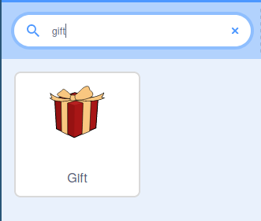
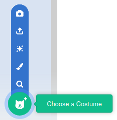

## ಪೆಟ್ಟಿಗೆಯಲ್ಲಿ ಉಡುಗೊರೆಯನ್ನು ಸೇರಿಸಿ

ಈ ಹಂತದಲ್ಲಿ, ನೀವು ಅದರೊಳಗೆ ಏನನ್ನು ಬಚ್ಚಿಡಲಾಗಿದೆ ಎಂದು ಸಂಕ್ಷಿಪ್ತವಾಗಿ ತೋರಿಸುವ ಉಡುಗೊರೆ ಪೆಟ್ಟಿಗೆಯನ್ನು ಸೇರಿಸುತ್ತೀರಿ.

--- task ---

ಹೊಸ Scratch ಪ್ರಾಜೆಕ್ಟ ತೆರೆಯಿರಿ.

**ಆನ್‌ಲೈನ್:**ಹೊಸ Scratch ಪ್ರಾಜೆಕ್ಟ್‌ನ್ನು ಇಲ್ಲಿ ತೆರೆಯಿರಿ [rpf.io/scratch-new](http://rpf.io/scratch-new){:target="_blank"}.

**ಆಫ್‌ಲೈನ್:** Scratch ಆಫ್‌ಲೈನ್‌ ಎಡಿಟರ್‌ನಲ್ಲಿ ಹೊಸ ಪ್ರಾಜೆಕ್ಟ್‌ ತೆರೆಯಿರಿ. ನಿಮಗೆ ಬೇಕಾದರೆ, ನೀವು [ಇಲ್ಲಿ Scratch ಡೌನ್‌ಲೋಡ್‌ ಮಾಡಿಕೊಂಡು ಇನ್‌ಸ್ಟಾಲ್‌ ಮಾಡಬಹುದು](http://rpf.io/scratchoff){:target="_blank"}.

--- /task ---

--- task ---

**Scratch cat** ಸ್ಪ್ರೈಟ್‌ನ್ನು ತೆಗೆದುಹಾಕಿ. ಇದನ್ನು ಮಾಡಲು, Sprite ಲಿಸ್ಟ್‌ನಲ್ಲಿರುವ ಚಿತ್ರದ ಮೂಲೆಯಲ್ಲಿರುವ **Rubbish bin** ಐಕಾನ್‌ ಮೇಲೆ ಕ್ಲಿಕ್‌ ಮಾಡಿ.


--- /task ---

--- task ---

ನಿಮ್ಮ ಆಟಕ್ಕೆ ಸೇರಿಸಲು ಹೊಸ ಸ್ಪ್ರೈಟ್‌ನ್ನು ಹುಡುಕಲು **Choose a Sprite** ಮೇಲೆ ಕ್ಲಿಕ್‌ ಮಾಡಿ.


--- /task ---

--- task ---

**Gift** ಸ್ಪ್ರೈಟ್‌ ಹುಡುಕಿ, ನಂತರ ನಿಮ್ಮ ಆಟಕ್ಕೆ ಅದನ್ನು ಸೇರಿಸಿ.



--- /task ---

--- task ---

ಸ್ಪ್ರೈಟ್‌ ಈ ಕ್ಷಣದಲ್ಲಿ ಸ್ವಲ್ಪ ಚಿಕ್ಕದಾಗಿದೆ. ಸ್ಪ್ರೈಟ್‌ ಗಾತ್ರವನ್ನು ಹೆಚ್ಚಿಸಲು, ನೀವು ಬೇರೆ ಪ್ರಾಜೆಕ್ಟ್‌ಗಳಲ್ಲಿ ಮಾಡಿದಂತೆ `set size to`{:class="block3looks"} ಬ್ಲಾಕ್‌ ಉಪಯೋಗಿಸಬಹುದು, ಅಥವಾ ನೀವು ಸ್ಪ್ರೈಟ್‌ನ **properties** ಬದಲಾಯಿಸಬಹುದು.

ಸ್ಪ್ರೈಟ್‌ ಗಾತ್ರವನ್ನು (ಶೇಕಡಾ) `150` ಗೆ ಹೊಂದಿಸಿ.


--- /task ---

--- task ---

**Gift** ಸ್ಪ್ರೈಟ್‌ಗೆ ಉಡುಪುಗಳನ್ನು ನೋಡಲು **Costumes** ಟ್ಯಾಬ್‌ಗೆ ಹೋಗಿ. ನೀವು **gift-a** ಮತ್ತು **gift-b** ಎನ್ನುವ ಎರಡು ಉಡುಪುಗಳನ್ನು ನೋಡುವಿರಿ.


ಸ್ಪ್ರೈಟ್‌ಗೆ ಹೊಸ ಉಡುಪನ್ನು ಸೇರಿಸಲು **Choose a Costume** ಐಕಾನ್‌ ಮೇಲೆ ಕ್ಲಿಕ್‌ ಮಾಡಿ.



--- /task ---

--- task ---

ಉಡುಗೊರೆ ಪೆಟ್ಟಿಗೆಯಲ್ಲಿ ನೀವು ಇರಿಸಲು ಬಯಸುವ ಉಡುಗೊರೆಯನ್ನು ಆರಿಸಿ. ಈ ಉದಾಹರಣೆಯಲ್ಲಿ, ನಾವು **Crystal-a** ಉಡುಪನ್ನು ಉಪಯೋಗಿಸುತ್ತೇವೆ.


--- /task ---

--- task ---

**Code** ಟ್ಯಾಬ್‌ಗೆ ಹಿಂದಿರುಗಿ, ನೀವು ಪ್ರೋಗ್ರಾಮ್‌ ಮೇಲೆ ಕೆಲಸ ಮಾಡಲು ಪ್ರಾರಂಭಿಸಬಹುದು.


**Gift** ಸ್ಪ್ರೈಟ್‌ಗೆ ಪ್ರಾರಂಭಿಕ ಉಡುಪನ್ನು ಮಾಡಲು `switch`{:class="block3looks"} ರಿಂದ `Crystal-a`{:class="block3looks"} ವರೆಗೆ ಕೆಲವು ಬ್ಲಾಕ್‌ಗಳನ್ನು ಸೇರಿಸಿ ಮತ್ತು ನಂತರ ಪುನಃ `gift-a`{:class="block3looks"} ಮರಳಿ ಬನ್ನಿ. ಉಡುಪುಗಳ ಬದಲಾವಣೆಗಳ ನಡುವೆ `wait`{:class="block3control"} ಬ್ಲಾಕ್‌ಗಳನ್ನು ಉಪಯೋಗಿಸಿ.

`wait`{:class="block3control"} ಬ್ಲಾಕ್‌ಗಳು ಆಟಗಾರನಿಗೆ ಉಡುಪುಗಳ ಬದಲಾವಣೆಗಳನ್ನು ನೋಡುವ ಅವಕಾಶ ಮಾಡಿಕೊಡುತ್ತವೆ.


```blocks3
when flag clicked
switch costume to [gift-a v]
wait (1) seconds
switch costume to [Crystal-a v]
wait (2) seconds
switch costume to [gift-a v]
```

--- /task ---

--- task ---

ಹಸಿರು ಧ್ವಜದ ಮೇಲೆ ಕ್ಲಿಕ್ ಮಾಡಿ ಮತ್ತು ನಿಮ್ಮ ಉಡುಗೊರೆ ಪೆಟ್ಟಿಗೆ ಉಡುಪುಗಳನ್ನು ಬದಲಾಯಿಸುತ್ತದೆ ಎಂದು ಖಚಿತಪಡಿಸಿಕೊಳ್ಳಿ.

--- /task ---

--- save ---
