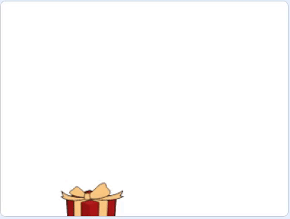

## ಉಡುಗೊರೆ ಪೆಟ್ಟಿಗೆಯನ್ನು ಚಲಿಸಿ

ಈಗ ನಿಮ್ಮ ಬಳಿ ಅದರೊಳಗೆ ಉಡುಗೊರೆ ಹೊಂದಿರುವ ಪೆಟ್ಟಿಗೆ ಹೊಂದಿರುವಿರಿ, ನೀವು ಅದನ್ನು ಪರದೆಯ ಸುತ್ತಲೂ ಚಲಿಸುವಂತೆ ಮಾಡಬೇಕು.

--- task ---

ಮೊದಲಿಗೆ, Stage ಎಡಭಾಗದಲ್ಲಿ ಉಡುಗೊರೆಗೆ ಪ್ರಾರಂಭಿಕ ಸ್ಥಾನವನ್ನು ಕೊಡಲು `go to x: y:`{:class="block3motion"} ಬ್ಲಾಕ್‌ ಉಪಯೋಗಿಸಿ.


```blocks3
when flag clicked
+ go to x: (-150) y: (0)
switch costume to [gift-a v]
wait (1) seconds
switch costume to [Crystal-a v]
wait (2) seconds
switch costume to [gift-a v]
```

--- /task ---

**Broadcasts** ಎಂದರೆ ಕೆಲವು ಅಥವಾ ಇತರೇ ಎಲ್ಲಾ ಸ್ಪ್ರೈಟ್‌ಗಳಿಗೆ ಸ್ವೀಕರಿಸಲು ಸ್ಪ್ರೈಟ್‌ ಕಳಿಸುವ ಸಂದೇಶಗಳು.

ನಿಮ್ಮ ಪ್ರೋಗ್ರಾಮ್‌ನಲ್ಲಿರವ ಎಲ್ಲಾ ಘಟನೆಗಳು ಏಕಕಾಲದಲ್ಲಿ ಸಂಭವಿಸುತ್ತವೆ ಎಂದು ಖಚಿತಪಡಿಸುಕೊಳ್ಳಲು ಬ್ರಾಡ್‌ಕ್ಯಾಸ್ಟ್‌ಗಳು ತುಂಬಾ ಉಪಯುಕ್ತವಾಗುತ್ತವೆ.

`Events`{:class="block3events"} ಬ್ಲಾಕ್‌ಗಳ ಮೆನುನಲ್ಲಿ, `broadcast message1 ಮತ್ತು wait`{:class="block3events"} ಬ್ಲಾಕ್‌ ಆಯ್ಕೆಮಾಡಿಕೊಳ್ಳಿ.

--- task ---

ಚಲಿಸುವುದನ್ನು ಪ್ರಾರಂಭಿಸಲು ಹೊಸ `broadcast`{:class="block3events"} ರಚಿಸಿ. ಹೊಸ ಬ್ರಾಡ್‌ಕಾಸ್ಟ್‌ `move` ಆಮಂತ್ರಿಸಿ.


--- /task ---

--- task ---

`wait`{:class="block3control"} ಬ್ಲಾಕ್ ಸೇರಿಸಿ, ನಂತರ `broadcast move and wait`{:class="block3events"} ಬ್ಲಾಕ್‌ ಸೇರಿಸಿ.


```blocks3
when flag clicked
go to x: (-150) y: (0)
switch costume to [gift-a v]
wait (1) seconds
switch costume to [Crystal-a v]
wait (2) seconds
switch costume to [gift-a v]
+ wait (1) seconds
+ broadcast [move v] and wait
```

--- /task ---

--- task ---

ಸ್ಪ್ರೈಟ್ `move`{:class="block3events"} ಬ್ರಾಡ್‌ಕಾಸ್ಟ್‌ `receives`{:class="block3events"}ಪಡೆದಾಗ, ಸ್ಪ್ರೈಟ್‌ `glide`{:class="block3motion"} ಯಾದೃಚ್ಛಿಕ ದಿಕ್ಕುಗಳಲ್ಲಿ ಜಾರಲು ಪ್ರಾರಂಭಿಸಬಹುದು. ನೀವು ಇದು `10` ಬಾರಿ ಪುನರಾವರ್ತನೆಯಾಗುವಂತೆ ಮಾಡಲು `repeat`{:class="block3control"} ಬ್ಲಾಕ್‌ ಉಪಯೋಗಿಸಬಹುದು.


```blocks3
when I receive [move v]
repeat (10)
glide (1) secs to [random position v]
```

--- /task ---

--- task ---

ಹಸಿರು ಬಾವುಟದ ಮೇಲೆ ಕ್ಲಿಕ್‌ ಮಾಡಿ, ಮತ್ತು ಉಡುಪು ಬದಲಾವಣೆಗಳಾದ ನಂತರ, ನಿಮ್ಮ ಸ್ಪ್ರೈಟ್‌ ಯಾದೃಚ್ಛಿಕವಾಗಿ ಚಲಿಸಲು ಪ್ರಾರಂಭಿಸುತ್ತದೆಯೇ ಎಂದು ಪರಿಶೀಲಿಸಿ.

--- no-print ---



--- /no-print ---

--- /task ---

--- save ---


