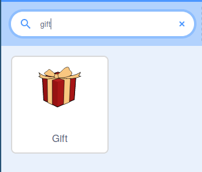
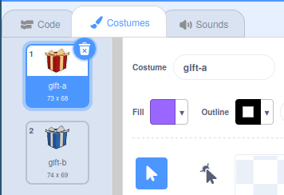
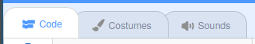

## बॉक्समध्ये भेटवस्तू जोडा

या टप्प्यात, तुम्ही एक भेट बॉक्स जोडाल जो त्याच्या आत काय लपलेले आहे ते थोडक्यात दर्शवेल.

--- task ---

नवीन Scratch प्रोजेक्ट उघडा.

**ऑनलाईन:** [rpf.io/scratch-new](http://rpf.io/scratch-new){:target="_blank"} वर एक नवीन ऑनलाइन Scratch प्रोजेक्ट उघडा.

**ऑफलाईन:** Scratch ऑफलाईन एडिटर मध्ये नवीन प्रोजेक्ट उघडा. तुम्हाला आवश्यकता वाटल्यास, तुम्ही [येथे Scratch डाऊनलोड आणि इंस्टॉल करू शकता](http://rpf.io/scratchoff){:target="_blank"}.

--- /task ---

--- task ---

**Scratch cat** स्प्राईट डिलीट करा. हे करण्यासाठी, स्प्राईट लीस्टमधील इमेजच्या कोपऱ्यातील **Rubbish bin** आयकॉनवर क्लिक करा.


--- /task ---

--- task ---

तुमच्या गेममध्ये नवीन स्प्राईट जोडण्यास शोधण्यासाठी **Choose a Sprite** वर क्लिक करा.


--- /task ---

--- task ---

**Gift** स्प्राईट शोधा, त्यानंतर तुमच्या गेममध्ये जोडा.



--- /task ---

--- task ---

स्प्राईट सध्या थोडा लहान आहे. स्प्राइटचा आकार वाढवण्यासाठी, तुम्ही एकतर `set size to`{:class="block3looks"} ब्लॉकमध्ये वापरू शकता, जसेकी तुम्ही इतर प्रोजेक्टमध्ये केले असेल, किंवा तुम्ही स्प्राईटचे **properties** बदलू शकता.

स्प्राईटचा आकार `150` (टक्के) वर सेट करा.


--- /task ---

--- task ---

**Gift** स्प्राईटसाठी कॉश्चुम बघण्यासाठी **Costumes** टॅबवर जा. तुम्हाला दोन कॉश्चुम दिसतील जे आहेत **gift-a** आणि **gift-b**.



स्प्राईटला नवीन कॉश्चुम जोडण्यासाठी **Choose a Costume** आयकॉनवर क्लिक करा.


--- /task ---

--- task ---

गिफ्ट बॉक्समध्ये तुम्हाला जी भेटवस्तू ठेवायची आहे ती निवडा. या उदाहरणात, आम्ही **Crystal-a** कॉश्चुम वापरू.


--- /task ---

--- task ---

**Code** टॅबवर परत जा जेणेकरुन तुम्ही प्रोग्रामवर काम करण्यास सुरुवात करू शकाल.



**Gift** `switch`{:class="block3looks"} ते `Crystal-a`{:class="block3looks"} आणि नंतर `gift-a`{:class="block3looks"} साठी सुरुवातीचा पोशाख बनवण्यासाठी काही ब्लॉक्स जोडा पुन्हा. कॉश्चुम बदलांमध्ये `wait`{:class="block3control"} ब्लॉक्स वापरा.

`wait`{:class="block3control"} ब्लॉक्स प्लेयरला कॉश्चुम बदल बघण्याची संधी देतात.


```blocks3
when flag clicked
switch costume to [gift-a v]
wait (1) seconds
switch costume to [Crystal-a v]
wait (2) seconds
switch costume to [gift-a v]
```

--- /task ---

--- task ---

हिरव्या झेंड्यावर क्लिक करा आणि तुमची भेट बॉक्स कॉश्चुम बदलत असल्याचे सुनिश्चित करा.

--- /task ---

--- save ---
