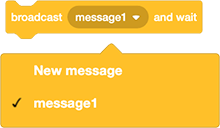
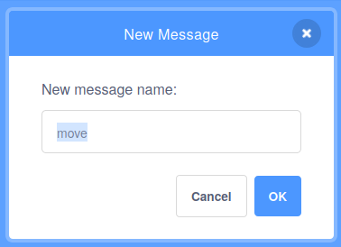

## भेटवस्तू बॉक्स हलवा

आता तुमच्याकडे आत भेटवस्तू असलेला बॉक्स आहे, तुम्हाला तो स्क्रीनभोवती फिरवावा लागेल.

--- task ---

भेटवस्तू सुरूवातीच्या ठिकाणापासून स्टेजच्या डावीकडे देण्यासाठी `go to x: y:`{:class="block3motion"} ब्लॉक प्रथम वापरा.


```blocks3
when flag clicked
+ go to x: (-150) y: (0)
switch costume to [gift-a v]
wait (1) seconds
switch costume to [Crystal-a v]
wait (2) seconds
switch costume to [gift-a v]
```

--- /task ---

**Broadcasts** हे असे मेसेज आहेत जे स्प्राईटकडून कोणालातरी किंवा इतर स्प्राईटला मिळण्यासाठी पाठवले जातात.

तुमच्या प्रोग्राममधील सर्व इव्हेंट्स सोबतच घडतील याची खात्री करण्यासाठी broadcasts फार उपयुक्त आहेत.

`Events`{:class="block3events"} ब्लॉक्स मेनूमध्ये, `broadcast message1 and wait`{:class="block3events"} ब्लॉक निवडा.

--- task ---

हलणे चालू करण्यासाठी नवीन `broadcast`{:class="block3events"} तयार करा. तुमच्या नवीन broadcast `move` ला कॉल करा.





--- /task ---

--- task ---

`wait`{:class="block3control"} ब्लॉक जोडा, त्यानंतर `broadcast move and wait`{:class="block3events"} ब्लॉक जोडा.


```blocks3
when flag clicked
go to x: (-150) y: (0)
switch costume to [gift-a v]
wait (1) seconds
switch costume to [Crystal-a v]
wait (2) seconds
switch costume to [gift-a v]
+ wait (1) seconds
+ broadcast [move v] and wait
```

--- /task ---

--- task ---

जेव्हा स्प्राईटला `move`{:class="block3events"} broadcast `receives`{:class="block3events"} झाल्यावर, sprite कोणत्याही दिशेत `glide`{:class="block3motion"} करणे चालू करू शकतात. तुम्ही हे `10` वेळा घडण्यासाठी `repeat`{:class="block3control"} ब्लॉक वापरू शकता.


```blocks3
when I receive [move v]
repeat (10)
glide (1) secs to [random position v]
```

--- /task ---

--- task ---

हिरव्या झेंड्यावर क्लिक करा, आणि कॉश्चुम बदलल्यानंतर तुमचा स्प्राईट कोठेही हलणे चालू करतो का ते तपासा.

--- no-print ---


--- /no-print ---

--- /task ---

--- save ---


