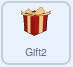
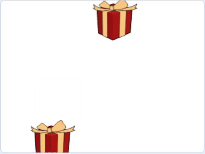

## एक रिकामा बॉक्स तयार करा

या टप्प्यात, तुम्ही दुसरा भेटवस्तू बॉक्स जोडाल, परंतु हा रिकामा असेल! ते कोणत्याही दिशेने भोवती फिरतील.

--- task ---

दुसरा **Gift** स्प्राईट जोडा. याचे नाव आपोआप **Gift2** होईल.


त्याचा आकार `150` (टक्के) ने वाढवण्याचे लक्षात ठेवा.

--- /task ---

--- task ---

Stage मध्यभागात चालू करण्यासाठी **Gift2** sprite सेट करा.



```blocks3
when green flag clicked
go to x: (0) y: (0)
```

--- /task ---

--- task ---

ब्लॉक्स जोडा जेणेकरून जेव्हा हा स्प्राईट `move`{:class="block3events"}, तेव्हा तो कोणत्याही दिशेत `receives move`{:class="block3motion"} होणे चालू करेल.


```blocks3
when I receive [move v]
repeat (10)
glide (1) secs to [random position v]
```

--- /task ---

--- task ---

हिरव्या झेंड्यावर क्लिक करा, आणि Stage भोवती हलणारे दोन स्प्राईट बघा.

--- no-print ---



--- /no-print ---

--- /task ---

बॉक्स नेहमी एकमेकांसारखे सारख्याच वेगाने फिरायला हवेत. याक्षणी, ते `glide 1 secs`{:class="block3motion"} वर सेट केले आहेत. दोन्ही बॉक्सचा वेग सहजतेने बदलण्यासाठी, तुम्ही `variable`{:class="block3variables"} चा वापर करू शकता.

--- task ---

नवीन `variable`{:class="block3variables"} तयार करा ज्याला म्हणतात `speed`, आणि तो `glide 1 secs to random position`{:class="block3motion"} ब्लॉकमध्ये जोडा. हा ब्लॉक **Gift** आणि **Gift2** स्प्राईट्समध्ये जोडा.


```blocks3
when I receive [move v]
repeat (10)
+ glide (speed) secs to [random position v]
```

--- /task ---

--- task ---

कोडमध्ये **Gift** स्प्राईटसाठी, तुम्ही `set`{:class="block3variables"} `speed`{:class="block3variables"} व्हेरिएबलला कोड जोडू शकता. तुम्हाला आवडणारी कोणतीही व्हॅल्यू निवडा.


```blocks3
when flag clicked
+ set [speed v] to (1)
go to x: (-150) y: (0)
switch costume to [gift-a v]
wait (1) seconds
switch costume to [Crystal-a v]
wait (2) seconds
switch costume to [gift-a v]
wait (1) seconds
broadcast [move v] and wait
```

--- /task ---

--- task ---

तुम्‍हाला आवडणारा वेग मिळेपर्यंत वेगवेगळ्या मूल्यांसह प्रयोग करा.

--- /task ---

--- save ---


