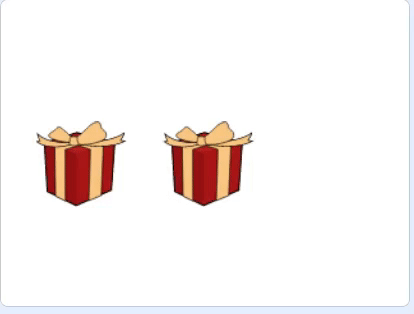

## उत्तरे उघड करा

या टप्प्यात, तुम्ही कोड जोडाल जेणेकरून खेळाडू गिफ्ट बॉक्समध्ये क्रिस्टल आहे की नाही हे पाहण्यासाठी त्यावर क्लिक करू शकेल.

--- task ---

कोडमध्ये **Gift** स्प्राईटसाठी, कोड जोडा जेणेकरून `when this sprite clicked`{:class="block3events"}, तो `says`{:class="block3looks"} `Yes!` आणि `switches costume to`{:class="block3looks"} क्रीस्टलला बदलतो.


```blocks3
when this sprite clicked
say [Yes!]
switch costume to [Crystal-a v]
```

--- /task ---

--- task ---

**Gift2** स्प्राईटवर क्लिक करा आणि ब्लॉक्स जोडा जेणेकरून तो`say`{:class="block3looks"} `No!`. `say`{:class="block3looks"} ब्लॉकची व्हॅल्यू `1` सेकंदला बदला. `hide`{:class="block3looks"} ब्लॉक जोडा जेणेकरून त्यानंतर स्प्राईट नाहीसा होतो.


```blocks3
when this sprite clicked
say [No!] for (1) seconds
hide
```

--- /task ---

--- task ---

**Gift2** स्प्राईट आता लपवले जाऊ शकते त्यामुळे, तुम्हाला प्रोग्राम चालू झाल्यावर तो दृश्य होतो का हे बघण्यासाठी `show`{:class="block3looks"} ब्लॉक जोडण्याची आवश्यकता आहे.


```blocks3
when green flag clicked
go to x: (0) y: (0)
+ show
```

--- /task ---

--- task ---

तुमचा कोड रन करण्यासाठी हिरव्या झेंड्यावर क्लिक करा, आणि तुम्ही बॉक्सवर क्लिक केल्यावर काय घडते ते तपासा.

--- /task ---

तुमच्या लक्षात येईल की ते फिरत असताना तुम्ही बॉक्सवर क्लिक करू शकता. तुम्ही याप्रमाणे खेळाडू करत असलेली चिटींग थांबविण्यासाठी `variable`{:class="block3variables"} वापरू शकता.

--- no-print ---

_

--- /no-print ---

--- task ---

नवीन `variable`{:class="block3variables"} तयार करा ज्याला `finished` म्हणतात. भेटवस्तू हलणे चालू करतात तेव्हा `finished`{:class="block3variables"} व्हेरिएबल `false` ला `set`{:class="block3variables"} करण्यासाठी ब्लॉक्स जोडा, आणि त्यानंतर भेटवस्तू हलणे बंद केल्यावर `true` ला जोडा.


```blocks3
when flag clicked
set [speed v] to (1)
+ set [finished v] to [false]
go to x: (-150) y: (0)
switch costume to [gift-a v]
wait (1) seconds
switch costume to [Crystal-a v]
wait (2) seconds
switch costume to [gift-a v]
wait (1) seconds
broadcast [move v] and wait
+ set [finished v] to [true]
```

--- /task ---

--- task ---

आता, तुम्ही `finished`{:class="block3variables"} हे बरोबर की चूक ते तपासण्यासाठी `if ... then`{:class="block3control"} जोडू शकता. `Operators`{:class="block3operators"} ब्लॉक जोडा जेणेकरून केवळ क्लिक केल्याने कोणताही परिणाम असेल जर `finished`{:class="block3variables"} `=`{:class="block3operators"} `true` असेल.


```blocks3
when this sprite clicked
+ if <(finished) = [true]> then
say [Yes!]
switch costume to [Crystal-a]
```

--- /task ---

--- task ---

तीच `if`{:class="block3control"} स्थिती **Gift2** स्प्राईटला जोडा.


```blocks3
when this sprite clicked
+ if <(finished) = [true]> then
say [No!] for (1) seconds
hide
```

--- /task ---

--- task ---

तुमच्या प्रोग्रामची चाचणी घ्या आणि तुम्ही स्प्राईटने भोवताली फिरणे पूर्ण केल्यावरच त्यावर केवळ क्लिक करू शकता हे बघायला हवे.

--- /task ---

--- save ---
	


