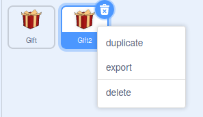

## अधिक भेटवस्तू जोडा

या टप्प्यात, भेटवस्तू हलणे थांबवतात तेव्हा एकमेकांना किंवा स्क्रीनच्या काठाला स्पर्श करत नाहीत याची खात्री कराल. त्यानंतर, तुम्ही तिसरी भेटवस्तू जोडाल.

भेटवस्तू बॉक्स एकमेकांच्या वर थांबतील हे शक्य आहे, ज्यामुळे भेटवस्तू बॉक्स कोणता आहे हे बघणे कठीण होऊ शकते. हे होण्यापासून थांबवण्यासाठी, ते स्पर्श करत आहेत का ते तुम्ही शोधू शकता. दोन बॉक्स एकमेकांना स्पर्श करत आहेत का हे ओळखण्यासाठी भेटवस्तू बॉक्स रिबीनच्या रंगाचा वापर केल्या जाऊ शकतो.

तुम्ही दाखवलेले स्प्राईट **दोन्ही** **Gift** आणि **Gift2** स्प्राईटच्या खाली जोडायला हवे.

--- task ---

**true** हा **false** मध्ये, किंवा **false** हा **true** मध्ये बदलण्यासाठी `not`{:class="block3operators"} ऑपरेटरचा तुम्ही वापर करू शकता.

तुमच्या स्क्रीप्टच्या खाली `repeat until`{:class="block3control"} ब्लॉक जोडा, आणि त्याच्या आत `not`{:class="block3operators"} ब्लॉक जोडा.


```blocks3
when I receive [move v]
repeat (10)
    glide (speed) secs to [random position v]
end
+ repeat until <not <>>
```

--- /task ---

--- task ---

`Sensing`{:class="block3sensing"} ब्लॉक जो स्प्राईट विशीष्ट रंगाला स्पर्श करत आहे का ते ओळखतो तो जेव्हा स्प्राईट त्या रंगाला स्पर्श करतो तेव्हा **true** मध्ये बदलेल.

तुम्ही `not`{:class="block3operators"} ऑपरेटरचा स्प्राईट विशीष्ट रंगाला `touching`{:class="block3sensing"} `not`{:class="block3operators"} हे ओळखण्यासाठी वापर करू शकता.

`touching color`{:class="block3sensing"} ब्लॉक जोडा, आणि रिबीनचा रंग निवडण्यासाठी **Colour picker** टूल वापरा.

--- no-print ---


--- /no-print ---


```blocks3
when I receive [move v]
repeat (10)
glide (speed) secs to [random position v]
end
+ repeat until <not <touching color (#F9C780)>>
```

--- /task ---

--- task ---

`repeat until`{:class="block3control"} ब्लॉक मध्ये, कुठल्याही ठिकाणी बॉक्स हलवत ठेवण्यासाठी दुसरा ब्लॉक जोडा.


```blocks3
when I receive [move v]
repeat (10)
glide (speed) secs to [random position v]
end
repeat until <not <touching color (#F9C780) ?>>
+ glide (speed) secs to [random position v]
```

--- /task ---

--- task ---

हिरव्या झेंड्यावर काही वेळा क्लिक करा आणि बॉक्स हलणे थांबण्यापूर्वी ते नेहमी Stage रिकाम्या भागात हलतील याची खात्री करा.

--- /task ---

Stage काठावरुन बॉक्स थांबले नाहीत तर ते देखील छान होईल. दोन वेगवेगळ्या स्थितींच्या चाचणीसाठी तुम्ही `and`{:class="block3operators"} ऑपरेटर वापरू शकता.

--- task ---

`and`{:class="block3operators"} ब्लॉक `repeat until`{:class="block3control"} स्थितीला जोडा. त्यानंतर, `not`{:class="block3operators"} ब्लॉकमध्ये जोडा आणि `touching edge`{:class="block3sensing"} ब्लॉक`not`{:class="block3operators"} `touching color`{:class="block3sensing"} ब्लॉक्सला न्या.


```blocks3
when I receive [move v]
repeat (10)
glide (speed) secs to [random position v]
end
repeat until < <not <touching color (#F9C780) ?>> and <not <touching [edge v] ?>>::operator +
glide (speed) secs to [random position v]
```

--- /task ---

--- task ---

बॉक्स आता Stage कडेला थांबत नाही याची खात्री करण्यासाठी तुमचा कोड पुन्हा तपासा.

--- /task ---

आता **Gift** आणि **Gift2** स्प्राईट पूर्ण झाले असल्याने, तुम्ही गेम मध्ये तीसरा बॉक्स जोडण्यासाठी **Gift2** स्प्राईट डुप्लीकेट करू शकता.

--- task ---

स्प्राईट लीस्टमधील **Gift2** स्प्राईटवर राईट-क्लिक करा आणि ड्रॉप-डाऊन मेनूमध्ये **suplicate** निवडा.



--- /task ---

--- task ---

सर्व कोड व्यवस्थित डुप्लीकेट झाले, परंतु तुम्ही **Gift3** स्प्राईटला वेगवेगळ्या सुरूवात स्थिती देण्याची आवश्यकता आहे.


```blocks3
when flag clicked
+ go to x: (150) y: (0)
show
```
--- /task ---

--- task ---

तुमचा गेम पुन्हा तपासण्यासाठी, हिरव्या झेंड्यावर क्लिक करा.

--- /task ---

--- save ---
