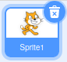
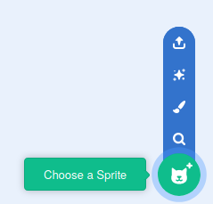
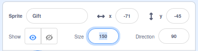
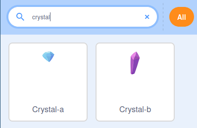

## ఒక పెట్టెలో బహుమతిని జోడించండి

ఈ దశలో, మీరు గిఫ్ట్ బాక్సును జోడిస్తారు, దానిలో దాగి ఉన్న వాటిని అది క్లుప్తంగా చూపుతుంది.

--- task ---

కొత్త Scratch ప్రాజెక్ట్‌ను తెరవండి.

**Online:** కొత్త ఆన్‌లైన్ Scratch ప్రాజెక్ట్‌ను [rpf.io/scratch-new](http://rpf.io/scratch-new){:target="_blank"} వద్ద తెరవండి.

**Offline:** Scratch ఆఫ్‌లైన్ ఎడిటర్‌లో కొత్త ప్రాజెక్ట్‌ను తెరవండి. మీకు అవసరమైతే, మీరు [ఇక్కడ Scratch ను డౌన్ లోడ్ చేసి ఇన్‌స్టాల్ చేయవచ్చు](http://rpf.io/scratchoff){:target="_blank"}.

--- /task ---

--- task ---

**Scratch cat** sprite ను తొలగించండి. దీన్ని చేయడానికి, స్ప్రైట్ జాబితాలోని చిత్రం యొక్క మూలలో ఉన్న **Rubbish bin** మీద క్లిక్ చేయండి.



--- /task ---

--- task ---

మీ గేమ్ కు జోడించడానికి కావల్సిన ఒక కొత్త sprite కోసం శోధించడానికి **Choose a Sprite** మీద క్లిక్ చేయండీ.



--- /task ---

--- task ---

**Gift** sprite కోసం శోధించండి, ఆపై దాన్ని మీ గేమ్‌కు జోడించండి.


--- /task ---

--- task ---

sprite ప్రస్తుతం కొద్దిగా చిన్నది. Sprite యొక్క పరిమాణాన్ని పెంచడానికి, మీరు ఇతర ప్రాజెక్టులలో చేసినట్టు `set size to`{:class="block3looks"} బ్లాక్‌ని ఉపయోగించవచ్చు లేదా మీరు sprite యొక్క **లక్షణాలను**. ను మార్చవచ్చు.

Sprite పరిమాణాన్ని `150` (శాతం) కి సెట్ చేయండి.



--- /task ---

--- task ---

**Gift** sprite కోసం costume లను చూడటానికి **Costumes** ట్యాబ్‌పై క్లిక్ చేయండి. **gift-a** మరియు **gift-b** అనే రెండు costume లను మీరు చూస్తారు.


Sprite కు కొత్త costume జోడించడానికి **Choose a Costume** చిహ్నం పై క్లిక్ చేయండి.


--- /task ---

--- task ---

మీరు బహుమతి పెట్టెలో ఉంచాలనుకుంటున్న బహుమతిని ఎంచుకోండి. ఈ ఉదాహరణలో, మనము **Crystal-a** costume ను ఉపయోగిస్తాము.



--- /task ---

--- task ---

**Code** ట్యాబ్‌కు తిరిగి మారండి, తద్వారా మీరు ప్రోగ్రామ్‌లో పని చేయడం ప్రారంభించవచ్చు.


**Gift** sprite కు ఆరంభ costume చేయడానికి కొన్ని బ్లాక్స్ జోడించండి `crystal-a`{: class= "block3looks"} నుంచి `switch`{: class = "block3looks"} అయి ఆపై తిరిగి `gift-a`{:class="block3looks"} కు. `wait`{:class="block3control"} బ్లాక్‌లను costume మార్పుల మధ్య ఉపయోగించండి.

`wait`{:class="block3control"} బ్లాక్‌లు ప్లేయర్ కు costume మార్పులను చూసే అవకాశాన్ని అందిస్తాయి.


```blocks3
when flag clicked
switch costume to [gift-a v]
wait (1) seconds
switch costume to [Crystal-a v]
wait (2) seconds
switch costume to [gift-a v]
```

--- /task ---

--- task ---

ఆకుపచ్చ జెండాపై క్లిక్ చేసి, మీ గిఫ్ట్ బాక్సు costume లను మార్చినట్లు నిర్ధారించుకోండి.

--- /task ---

--- save ---
