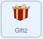
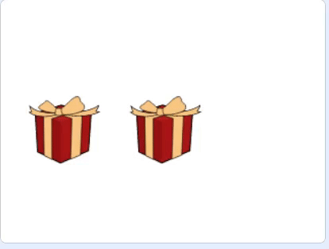

## సమాధానాలు వెల్లడించండి

ఈ దశలో, మీరు కోడ్‌ని జోడిస్తారు, తద్వారా ప్లేయర్ గిఫ్ట్ బాక్సులో crystal ఉందో లేదో చూడటానికి దానిపై క్లిక్ చేయవచ్చు.

--- task ---

**Gift** sprite కోడ్‌లో, కోడ్‌ని జోడించండి, తద్వారా `when this sprite clicked`{:class="block3events"} అది `Yes!` అని చెప్తుంది (`says`{:class="block3looks"}) మరియు crystal కి అది costume మారుస్తుంది (`switch costume to`{:class="block3looks"}).


```blocks3
when this sprite clicked
say [Yes!]
switch costume to [Crystal-a v]
```

--- /task ---

--- task ---

**Gift 2** sprite పై క్లిక్ చేసి బ్లాక్‌లను జోడించండి, తద్వారా అది `No!` అని చెప్తుంది (`say`{:class="block3looks"}). `say`{:class="block3looks"} బ్లాక్ విలువను `1` సెకన్లకు మార్చండి. `hide`{:class="block3looks"} బ్లాక్‌ను జోడించండి, తద్వారా sprite అదృశ్యమవుతుంది.



```blocks3
when this sprite clicked
say [No!] for (1) seconds
hide
```

--- /task ---

--- task ---

**Gift 2** sprite ఇప్పుడు దాచబడుతుంది కాబట్టి ప్రోగ్రామ్ మొదలయ్యేటప్పటికి అది కనిపించేలా `show`{:class="block3looks"} బ్లాక్‌ని జోడించాలి.


```blocks3
when green flag clicked
go to x: (0) y: (0)
+ show
```

--- /task ---

--- task ---

మీ కోడ్‌ని అమలు చేయడానికి ఆకుపచ్చ జెండాపై క్లిక్ చేయండి మరియు మీరు బాక్స్‌లపై క్లిక్ చేసినప్పుడు ఏమి జరుగుతుందో పరీక్షించండి.

--- /task ---

బాక్స్‌లు చుట్టూ తిరుగుతున్నప్పుడు వాటిపై క్లిక్ చేయగలరని మీరు గమనించవచ్చు. ప్లేయర్‌లు ఇలా మోసం చేయడం ఆపడానికి మీరు `variable`{:class="block3variables"}ని ఉపయోగించవచ్చు.

--- no-print ---

_

--- /no-print ---

--- task ---

`finished` అని పిలువబడే కొత్త `variable`{:class="block3variables"}ని సృష్టించండి. `finished`{:class="block3variables"} వేరియబుల్‌కి, గిఫ్ట్స్ కదలడం ప్రారంభించినపుడు `false` అని, గిఫ్ట్స్ ఆగినపుడు `true` అని, `set`{:class="block3variables"} చేసేలా, బ్లాకులను జోడించండి.


```blocks3
when flag clicked
set [speed v] to (1)
+ set [finished v] to [false]
go to x: (-150) y: (0)
switch costume to [gift-a v]
wait (1) seconds
switch costume to [Crystal-a v]
wait (2) seconds
switch costume to [gift-a v]
wait (1) seconds
broadcast [move v] and wait
+ set [finished v] to [true]
```

--- /task ---

--- task ---

ఇప్పుడు, `if … then`{:class="block3control"} బ్లాక్‌ని ఉపయోగించి. `finished`{:class="block3variables"} విలువ true లేదా false అని నిర్ధారించవచ్చు. `Operators`{:class="block3operators"} బ్లాక్‌ను జోడించండి, తద్వారా `finished`{:class="block3variables"} `=`{:class="block3operators"} `true` అయితే మాత్రమే క్లిక్ చేయడం వల్ల ఏదైనా ప్రభావం ఉంటుంది.


```blocks3
when this sprite clicked
+ if <(finished) = [true]> then
say [Yes!]
switch costume to [Crystal-a]
```

--- /task ---

--- task ---

అదే `if`{:class="block3control"} షరతును **Gift2** spriteకు జోడించండి.


```blocks3
when this sprite clicked
+ if <(finished) = [true]> then
say [No!] for (1) seconds
hide
```

--- /task ---

--- task ---

మీ ప్రోగ్రామ్‌ను పరీక్షించండి మరియు sprite లు చుట్టూ తిరగడం పూర్తయిన తర్వాత మాత్రమే మీరు వాటిపై క్లిక్ చేయగలిగేలా మీరు చూడాలి.

--- /task ---

--- save ---
	


