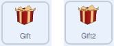
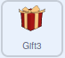

## మరిన్ని బహుమతులు జోడించండి

ఈ దశలో, బహుమతుల కదలిక ఆగినప్పుడు అవి ఒకదానికొకటి లేదా స్క్రీన్ అంచుకు తాకకుండా, మీరు నిర్ధారించుకుంటారు. అప్పుడు, మీరు మూడవ బహుమతిని జోడిస్తారు.

గిఫ్ట్ బాక్సులు ఒకదానిపై ఒకటి ఆగిపోయే అవకాశం ఉంది, ఇది ఏ గిఫ్ట్ బాక్సు ఏది అని చూడటం కష్టతరం చేస్తుంది. ఇది జరగకుండా ఆపడానికి, అవి తాకినట్లయితే మీరు గుర్తించవచ్చు. రెండు బాక్సులు ఒకదానికొకటి తాకుతున్నాయో లేదో తెలుసుకోవడానికి గిఫ్ట్ బాక్సు యొక్క రిబ్బన్ రంగును ఉపయోగించవచ్చు.

మీరు దిగువ చూపిన స్క్రిప్ట్‌లను **రెండూ** **Gift** మరియు **Gift2** sprite లకు జోడించాలి.

--- task ---

మీరు `not`{:class="block3operators"} ఆపరేటర్‌ని ఉపయోగించి **true** ని **false** గా లేదా **false** ని **true** గా మార్చవచ్చు.

ఒక `repeat until`{:class="block3control"} బ్లాకు ను స్క్రిప్టు అడుగున జోడించండి, మరియు ఒక `not`{:class="block3operators"} బ్లాకుని దాని లోపల జోడించండి.




```blocks3
when I receive [move v]
repeat (10)
    glide (speed) secs to [random position v]
end
+ repeat until <not <>>
```

--- /task ---

--- task ---

ఒక sprite ఒక నిర్దిష్ట రంగును తాకినట్లయితే `Sensing`{:class="block3sensing"} బ్లాక్ కనిపెడుతుంది మరియు sprite ఆ రంగును తాకినప్పుడు **true** ని రిటర్న్ చేస్తుంది.

మీరు `not`{:class="block3operators"} ఆపరేటర్‌ని ఉపయోగించి, ఒక sprite ఒక నిర్దిష్ట రంగుని `touching`{:class="block3sensing"} `not`{:class="block3operators"} అని తెలుసుకోవచ్చు.

`touching color`{:class="block3sensing"} బ్లాక్‌ను జోడించి, రిబ్బన్ రంగును ఎంచుకోవడానికి **Colour picker** టూల్ ను ఉపయోగించవచ్చు.

--- no-print ---


--- /no-print ---


```blocks3
when I receive [move v]
repeat (10)
glide (speed) secs to [random position v]
end
+ repeat until <not <touching color (#F9C780)>>
```

--- /task ---

--- task ---

`repeat until`{:class="block3control"} బ్లాక్ లోపల, బాక్స్‌ను యాదృచ్ఛిక స్థానానికి తరలించడానికి మరొక బ్లాక్‌ని జోడించండి.,.


```blocks3
when I receive [move v]
repeat (10)
glide (speed) secs to [random position v]
end
repeat until <not <touching color (#F9C780) ?>>
+ glide (speed) secs to [random position v]
```

--- /task ---

--- task ---

ఆకుపచ్చ జెండాపై కొన్ని సార్లు క్లిక్ చేయండి మరియు బాక్స్‌లు కదలకుండా ఆపే ముందు ఎల్లప్పుడూ Stage లో ఖాళీ ప్రాంతానికి తరలించేలా చూసుకోండి.

--- /task ---

బాక్సులను Stage అంచుల వద్ద ఆపివేయకుండా ఉంటే కూడా మంచిది. రెండు విభిన్న కండిషన్ లను పరీక్షించటం కోసం, మీరు `and`{:class="block3operators"} ఆపరేటర్‌ను ఉపయోగించవచ్చు.

--- task ---

`repeat until`{:class="block3control"} కండిషన్ లోనికి, ఒక `and`{:class="block3operators"} బ్లాక్‌ను జోడించండి. ఆపై, `not`{:class="block3operators"} బ్లాకు మరియు `touching edge`{:class="block3sensing"} బ్లాక్‌లను, `not`{:class="block3operators"} బ్లాక్ మరియు `touching color `{:class="block3sensing"} బ్లాక్‌లతో కలిపి జోడించండి.


```blocks3
when I receive [move v]
repeat (10)
glide (speed) secs to [random position v]
end
repeat until < <not <touching color (#F9C780) ?>> and <not <touching [edge v] ?>>::operator +
glide (speed) secs to [random position v]
```

--- /task ---

--- task ---

ఇప్పుడు బాక్స్‌లు Stage అంచు వద్ద ఆగకుండా చూసుకోవడానికి మీ కోడ్‌ని మళ్లీ పరీక్షించండి.

--- /task ---

ఇప్పుడు **Gift** మరియు **Gift2** sprite ల కోడ్ పూర్తయింది, **Gift 2** sprite ని నకలు చేసి, మూడవ బాక్సుని, గేమ్ కి జోడించవచ్చు.

--- task ---

Sprite జాబితాలో **Gift2** sprite పై రైట్-క్లిక్ చేసి, డ్రాప్-డౌన్ మెనులో **duplicate** ను సెలెక్ట్ చేసుకోండి.


--- /task ---

--- task ---

అంతా కోడ్, డూప్లికేట్ చేయబడింది, కానీ మీరు **Gift3** spriteకి వేరే ప్రారంభ స్థానం ఇవ్వాలి.



```blocks3
when flag clicked
+ go to x: (150) y: (0)
show
```
--- /task ---

--- task ---

మీ గేమ్‌ని మళ్లీ పరీక్షించడానికి, ఆకుపచ్చ జెండాపై క్లిక్ చేయండి.

--- /task ---

--- save ---
