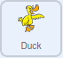

## ధ్యాస మరల్చండి

గేమ్‌ను పూర్తి చేయడానికి, మీరు ఆటగాడి దృష్టిని, గిఫ్ట్ బాక్స్‌పై నుంచి మరల్చడానికి ప్రయత్నించడానికి డిస్ట్రాక్షన్ ను జోడించవచ్చు.

--- task ---

మీ గేమ్‌కి కొత్త spriteని జోడించండి. మీరు మీకు నచ్చిన sprite ని ఎంచుకోవచ్చు, కానీ ఈ ఉదాహరణలో, మనము **Duck** sprite ని ఉపయోగిస్తాము.



--- /task ---

ఆట ప్రారంభమైనప్పుడు, duck దాచబడాలి మరియు బాక్సులు కదలడం ప్రారంభించిన తర్వాత మాత్రమే అది కదలడం ప్రారంభించాలి. Duck ని, ముందు పొరకు తీసుకురావడం కూడా ఉపయోగపడుతుంది, తద్వారా ఇది బాక్సుల పైభాగంలో కదులుతుంది.

--- task ---

కింది బ్లాక్‌లను **Duck** spriteకు జోడించండి.


```blocks3
when flag clicked
hide
go to [front v] layer
wait (4) seconds
```

--- /task ---

--- task ---

తరువాత, **Duck** sprite, ఒక `random`{:class="block3operators"} సెకన్లు నరకు, `wait`{:class="block3control"} చేసి, ఆపై Stage అంతటా `glide`{:class="block3motion"}  అవడం ప్రారంభించాలి మరియు `hide`{:class="block3looks"} అవ్వాలి. ఆట పూర్తయ్యే వరకు ఇది జరుగుతూనే ఉంటుంది.


```blocks3
when flag clicked
hide
go to [front v] layer
wait (4) seconds
+ repeat until <(finished) = [true]>
wait (pick random (1) to (5)) seconds
go to x: (-280) y: (-140)
show
glide (2) secs to x: (280) y: (140)
hide
```
--- /task ---

--- task ---

మీ గేమ్‌ని పరీక్షించండి మరియు Stage మీదుగా ఎగురుతున్న డిస్ట్రాక్షన్ duck ఉండగా మీరు, గిఫ్ట్ బాక్స్‌ను ట్రాక్ చేయగలరో లేదో చూడండి.

--- /task ---

--- save ---

